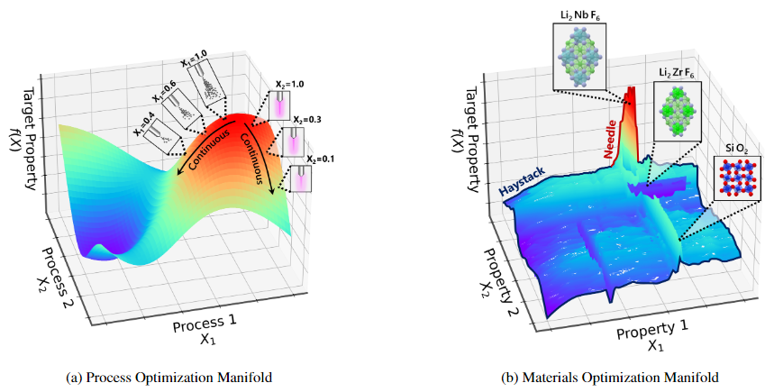

# Zooming Memory-Based Initialization (`ZoMBI`)

This software package implements the Zooming Memory-Based Initialization (`ZoMBI`) algorithm as an augmentation to standard Bayesian optimization. The `ZoMBI` algorithm augments standard Bayesian optimization by:
  1. Zooming in the bounds of the search space for each dimension based on previously high-performing datapoints stored in memory to quickly find solutions to "needle-in-a-haystack" problems
  2. Purging the memory of all other historical data points to accelerate algorithm compute times from $O(n^3)$ to $O(1)$

The package has two primary components:

- **Adaptive learning acquisition functions**: Implementation of the LCB Adaptive and EI Abrupt custom acquisition functions that use adaptive learning to tune the sampling of new data points within the search space (in `acquisitions.py`).
- **The `ZoMBI` optimization algorithm**: Takes in a multi-dimensional, complex "needle-in-a-haystack" dataset and optimizes it using one of the selected acquisition functions (in `zombi.py`).

# How to Cite
Please cite our paper if you want to use `ZoMBI`:

# Table of Contents
- [Zooming Memory-Based Initialization (`ZoMBI`)](#zooming-memory-based-initialization-zombi)
- [How to Cite](#how-to-cite)
- [File Summary](#file-summary)
- [Installation](#installation)
- [Usage](#usage)
- [Datasets](#datasets)
  - [5D Ackley Function](#5d-ackley-function)
  - [5D Negative Poisson's Ratio](#5d-negative-poissons-ratio)
- [Authors](#authors)

# File Summary
| Files | Description |
| ------------- | ------------------------------ |
| [examples.ipynb](./examples.ipynb)  | Run ZoMBI on the example datasets 5D Ackley function and 5D Negative Poisson's Ratio. |
| [zombi.py](./zombi.py)  | Code to run the ZoMBI optimization procedure. |
| [acquisitions.py](./acquisitions.py)  | Code for the acquisition functions LCB, LCB Adaptive, EI, and EI Abrupt. |
| [utils.py](./utils.py)  | Utility code for ZoMBI optimization and plotting. |
| [data/ackley](./data/ackley)  | Folder containing the pickled ensemble data for each acquisition function in the paper over 1,000 experiments on the 5D Ackley dataset. |
| [data/poisson](./data/poisson)  | Folder containing the pickled ensembel data for each acquisition function in the paper over 200 experiments on the 5D Poisson's ratio dataset, the [code to train the RF Poisson's ratio model](./data/poisson/train_RF.py) and the [pickled pre-trained RF Poisson's ratio model](./data/poisson/poisson_RF_trained.pkl). |

# Installation
Install the `diversipy` package: `python -m pip install git+https://github.com/DavidWalz/diversipy`. 

# Usage
To use the `ZoMBI` algorithm, call `from zombi import *` and instantiate the `ZoMBI(·)` class variables:

| Class Variable | Input |
| ------------- | ------------------------------ |
| `dataset_X` | An (n,d) array of data points to sample from, where n is the number of data points and d is the number of dimensions. |
| `dataset_fX` | An (n,) array of labels, f(X), for the corresponding X data. |
| `fX_model` | A model or function of the form `func(X)` to predict f(X) from X data. |
| `BO` | The user-selected acquisition function. Options: `LCB`, `LCB_ada`, `EI`, `EI_abrupt`. |
| `nregular` | The number of regular BO experiments to run before `ZoMBI`. |
| `activations` | The number of `ZoMBI` activations. |
| `memory` | The number of memory points to retain per `ZoMBI` activation. |
| `forward` | The number of forwar experiments to run per `ZoMBI` activation. |
| `ensemble` | The number of independent ensemble runs. |

The optimization procedure begins by calling `ZoMBI(·).optimize(X_initial, fX_initial)` with an initialization dataset and corresponding labels. For multi-dimensional datasets, using Latin Hypercube Sampling across d-dimensions is suggested: `X_initial = diversipy.polytope.sample(n_points=5, lower=np.zeros((1, d))[0], upper=np.ones((1, dimensions))[0], thin=0)`. After running the optimization procedure, the X and fX values predicted by `ZoMBI` are obtained using `ZoMBI(·).X` and `ZoMBI(·).fX`.

Implementation of this code is demonstrated in [examples.ipynb](./examples.ipynb).

# Datasets
We implement two datasets to illustrate the performance of the `ZoMBI` algorithm:
### 5D Ackley Function
The Ackley function is a non-convex benchmarking function with several local minima and one sharp, "needle-like" global minimum. In [examples.ipynb](./examples.ipynb) we explore a 5D Ackley function with $b=0.5$ optimum narrowness, where $b\in[0,1]$, as $b \to 1$, the optimum becomes more narrow. In the paper, we explore 2D-10D Ackley functions with narrowness $b=0.05$ to $b=1.0$.

The analytical model for the Ackley function is:
$f(X) = -a\textrm{exp}\left(-b \sqrt{\frac{1}{d}\sum X^2_i}\right) - \textrm{exp}\left(\frac{1}{d}\sum\textrm{cos}(c X_i)\right) + a + \textrm{exp}(1)$

### 5D Negative Poisson's Ratio
The Poisson's ratio dataset is a set of 146,323 materials (*as of 30 June 2022*) from the [Materials Project Database](https://materialsproject.org/). Only 0.81% of the materials in the dataset have a negative Poisson's ratio, the rest are positive. Poisson's ratio indicates whether a material's cross-section expands or contracts when under compressive or tensile applied loads. We deploy `ZoMBI` to minimize the Poisson's ratio acros 5 material properties: 
`X = [Molecular Density,
Atmoic Energy,
Fermi Energy,
Energy Above Hull,
Band Gap]`. Very few materials exhibit negative Poisson's ratios, resulting in a "needle-in-a-haystack" challenge.

# Authors
The code was written by Alexander E. Siemenn and Zekun Run, under the supervision of Tonio Buonassisi and Qianxiao Li.
